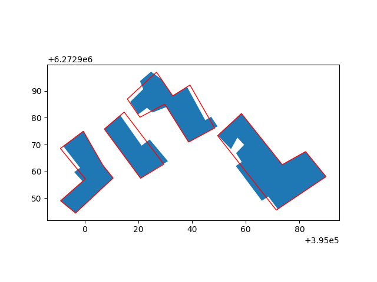
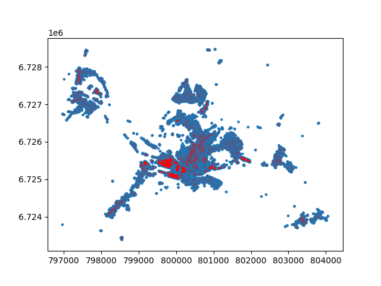

========
CartAGen
========

.. Documentation at RTD — https://readthedocs.org

.. image:: https://readthedocs.org/projects/cartagen4py/badge/?version=latest
   :alt: Documentation Status
   :target: https://cartagen4py.readthedocs.io/en/latest/

.. PyPI

.. image:: https://img.shields.io/pypi/v/cartagen4py.svg
   :alt: PyPI
   :target: https://pypi.org/project/cartagen4py/

.. image:: https://img.shields.io/github/contributors/LostInZoom/cartagen4py
   :target: https://github.com/LostInZoom/cartagen4py/graphs/contributors

`cartagen4py <https://github.com/LostInZoom/cartagen4py>`_ is an open Python library dedicated to cartogaphic generalisation. It is originally a port of the CartAGen Java platform, developed at IGN France and Univ. Gustave Eiffel.

Apply map generalisation operations
^^^^^^^^^^^^^^^^^^^^^^^^^^^^^^^^^^^

Orchestrate multiple algorithms
^^^^^^^^^^^^^^^^^^^^^^^^^^^^^^^

Enrich your cartographic data
^^^^^^^^^^^^^^^^^^^^^^^^^^^^^

Evaluate your generalised map
^^^^^^^^^^^^^^^^^^^^^^^^^^^^^^

.. toctree::
   :caption: User Guide
   :hidden:

   installation_py
   changelog
   manual
   bibliography

.. toctree::
   :caption: API Reference
   :hidden:

   points
   lines
   polygons
   networks
   bends
   processes
   partitioning
   tools

.. toctree::
   :caption: Plugin QGIS
   :hidden:

   installation_qgis