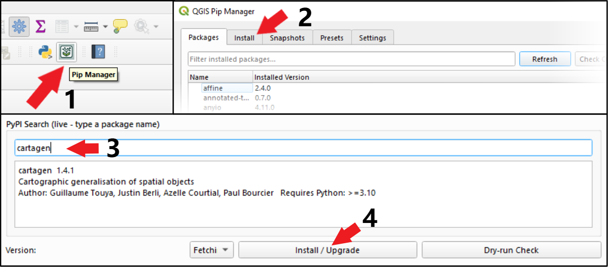

.. _qgis:

===========
QGIS Plugin
===========

.. .. image:: https://img.shields.io/github/v/release/LostInZoom/cartagen-qgis?color=306998&style=flat-square
..    :alt: QGIS plugin
..    :target: https://github.com/LostInZoom/cartagen-qgis

CartAGen is also available as a QGIS processing plugin |logosub|. This
adds a new toolbox containing the different algorithms of the
Python library. The version of the plugin is tied to a specific
version of CartAGen which is shipped inside the plugin.

.. |logosub| image:: https://img.shields.io/github/v/release/LostInZoom/cartagen-qgis?color=306998&style=flat-square&label=%20
   :target: https://github.com/LostInZoom/cartagen-qgis

Installation
============

The plugin is currently available in the `official QGIS plugin repository <https://plugins.qgis.org/plugins/cartagen4qgis/>`_.
Currently, when the plugin loads, a dialogue box informs you whether you already have the CartAGen Python library or whether you need to install it manually (it was previously possible to install the library directly from this dialogue box, but this feature is no longer available).
There are various ways to install the CartAGen library, as described below.
If you are using Linux, **we recommend using the Flatpak version** as its Python environment is isolated from the global Python
environment.

QGIS Pip Manager plugin
-----

QGIS Pip Manager is a plugin that makes it easier to manage Python dependencies for QGIS. Once downloaded from the QGIS plugins menu, simply follow these steps:
  - 1/ Open the QGIS Pip Manager window.
  - 2/ Click on the "Install" tab.
  - 3/ Search for "cartagen" in the PyPi search bar. The name, version and description of the CartAGen Python library should appear.
  - 4/ Click "Install / Update"… and that's it!

You can also use the following methods to install the CartAGen Python library for QGIS (depending on your system).

Linux
-----

Flatpak (recommended)
^^^^^^^^^^^^^^^^^^^^^

We recommend using `Flatpak <https://flatpak.org/>`_ to install QGIS (as described `here <https://qgis.org/resources/installation-guide/#flatpak>`_)
to avoid having to mess with the system-wide pip packages and potentially conflict with the OS.
Flatpak can be seen as a package installer to install containerized softwares on your computer. This
allows you to install CartAGen and all its dependencies inside this container.

Use the following command to install CartAGen on the QGIS pip::

    $ flatpak run --devel --command=pip3 org.qgis.qgis install cartagen --user

If you run into the following error: `error: runtime/org.kde.Sdk/x86_64/VERSION not installed`, you need to install the proper SDK by
running the following command (where VERSION is the version that appears in the error)::

    $ flatpak install runtime/org.kde.Sdk/x86_64/VERSION

Debian/Ubuntu
^^^^^^^^^^^^^

Depending on your linux distribution, the installation of CartAGen system-wide can be different.
Please keep in mind that installing system-wide pip packages using this solution will conflict
with the apt packages of your system. Continue at your own risks.

One way to install the CartAGen Python package for QGIS is to use this command outside of a python environment::

    $ pip install cartagen

If you are running Debian 12 or above, you might get an error from the system because you are
trying to install the package outside of a virtual environment.
You can bypass this error by using the ``--break-system-package`` flag::

    $ pip install --break-system-package cartagen

Windows
-------

To install a Python package for QGIS in Windows (from
`this blog post <https://landscapearchaeology.org/2018/installing-python-packages-in-qgis-3-for-windows/>`_):

#. Open OSGeo4W shell, it should be available in your start menu
#. Type ``py3_env`` in the console (This should print paths of your QGIS Python installation)
#. Use pip to install CartAGen::
    
    python -m pip install cartagen